<div align="center">



</div>

## About Me

I'm Selim, a software developer from Turkey. I build practical web apps, desktop tools, automation flows, and small business software with a focus on useful interfaces and reliable systems.

- Building web and desktop applications
- Creating automation systems and productivity tools
- Working with Python, JavaScript, TypeScript, React, Node.js, Docker, and databases
- Interested in clean workflows, simple products, and tools that save time

## Tech Stack

<div align="center">


</div>

## What I Build

```text
Web Apps          -> dashboards, tools, business workflows
Desktop Apps      -> local utilities and productivity software
Automation        -> repeatable workflows, integrations, data flows
Backend Systems   -> APIs, databases, authentication, background jobs
```


